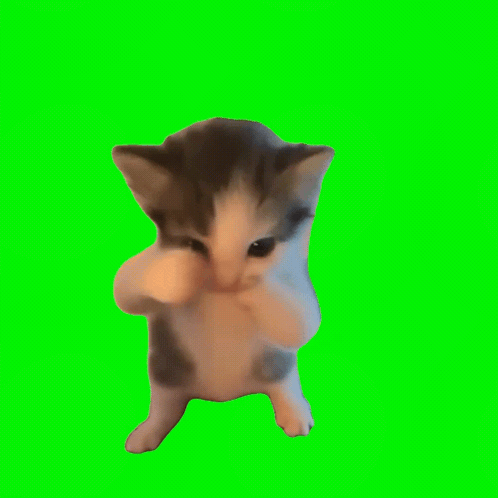

# 🐦 Kicau Mania Gesture Detector 🐦



Aplikasi seru menggunakan **Computer Vision (AI)** yang akan mendeteksi gaya khas "Kicau Mania" milikmu melalui webcam! 

Cukup **taruh tangan kirimu di depan mulut** dan **lambaikan tangan kananmu**, maka seketika Scuba Cat akan muncul berjoget diiringi musik Kicau Mania! 🐈🌊🔥

## ✨ Fitur Utama
- **Real-time AI Tracking**: Melacak wajah dan tangan tanpa lag menggunakan Google MediaPipe.
- **Smart Gesture Recognition**: Hanya aktif ketika gerakan tangan di mulut dan lambaian dilakukan secara bersamaan.
- **Auto-Stop**: Begitu gerakan lambaian berhenti, musik dan efek animasi akan otomatis menghilang.
- **Chroma Key (Green Screen Removal)**: Background hijau dari GIF animasi otomatis dihapus secara *real-time* sehingga menyatu sempurna dengan latar belakang kameramu.

## 🚀 Cara Menjalankan

### Persyaratan
Pastikan kamu sudah menginstall Python di komputermu (versi 3.9 - 3.12).

### 1. Install Library yang Dibutuhkan
Buka terminal dan jalankan perintah ini untuk menginstall OpenCV dan MediaPipe:
```bash
pip install -r requirements.txt
```
*(Catatan: Aplikasi ini menggunakan MediaPipe versi `0.10.14` agar stabil)*

### 2. Jalankan Program
Di dalam folder project ini, jalankan:
```bash
python main.py
```
*(Jika kamu menggunakan Windows dan versi Python terbaru, kamu bisa menggunakan `py -3.12 main.py`)*

---

### 🎮 Cara Pakai
1. Saat jendela kamera terbuka, **taruh tangan kiri-mu menempel / sangat dekat dengan mulut** (seolah-olah sedang meniup peluit/bersiul).
2. Sambil menahan tangan kiri di mulut, **lambaikan tangan kanan-mu dengan cepat** ke kiri dan kanan (seperti sedang mengipas).
3. **BOOM!** 4 Kucing Scuba akan muncul di sudut layar dan musik MP3 akan terputar.
4. Berhenti melambaikan tangan untuk mematikan efeknya.
5. Tekan tombol **Q** di keyboard jika ingin menutup kamera.

---
*Dibuat menggunakan Python, OpenCV (cv2), dan MediaPipe.*
